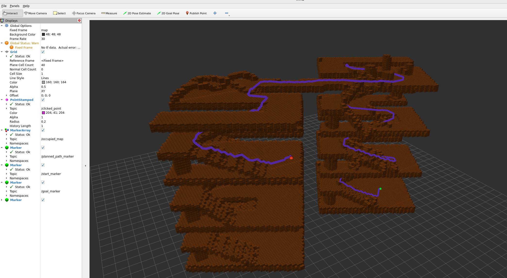

# OctoPlanner3D-ROS2

OctoPlanner3D-ROS2 是基于纯 C++ 版本 [OctoPlanner3D](https://github.com/JackJu-HIT/OctoPlanner3D) 封装的 ROS2 可视化测试版本，主要用于验证 3D 全局路径规划算法在不同场景下的规划效果、性能表现和能力边界。

## 项目说明

本项目在原有纯 C++ 版本 OctoPlanner3D 的基础上增加了 ROS2 外壳，用于更方便地进行地图加载、路径规划和 RViz2 可视化测试。

需要说明的是：

- 核心规划算法仍然保持纯 C++ 实现；
- ROS2 部分主要负责节点封装、参数管理和可视化发布；
- 地图可视化没有使用 `octomap_msgs` 消息类型，而是通过 `visualization_msgs::msg::MarkerArray` 发布体素地图；
- 起点和终点可通过 RViz2 中的 `Publish Point` 工具进行交互式下发；
- 项目主要用于测试 OctoPlanner3D 算法在三维场景、跨楼层场景和复杂障碍环境下的规划能力。

---

## 运行效果

RViz2 可视化运行效果如下：



---

## 依赖环境

- ROS2
- PCL
- Eigen
- CMake / colcon

---

## 编译方法

```bash
# 克隆仓库（含 submodule）
git clone --recurse-submodules https://github.com/ypat999/OctoPlanner3D-ROS2.git

# 编译
colcon build --packages-select octo_planner3d
````

编译完成后，加载环境变量：

```bash
source install/setup.bash
```

---

## 运行方法

推荐使用 launch 文件启动（自动加载参数）：

```bash
ros2 launch octo_planner3d octo_planner3d.launch.py
```

也可直接运行节点并手动传参：

```bash
ros2 run octo_planner3d octo_planner_rviz_node --ros-args -p input_pcd:="/path/to/your/map.pcd"
```

运行后可在 RViz2 中查看：

* OctoMap 体素地图
* 起点与终点
* 三维规划路径
* 路径搜索结果

---

## 通过 RViz2 下发起点和终点

本项目支持通过 RViz2 的 `Publish Point` 工具交互式设置规划起点和终点，所有参数通过 `config/params.yaml` 配置。

使用方式如下：

1. 启动节点：

```bash
ros2 launch octo_planner3d octo_planner3d.launch.py
```

2. 打开 RViz2：

```bash
rviz2
```

3. 在 RViz2 顶部工具栏中选择 `Publish Point`。

4. 在地图中点击第一个点，作为规划起点。

5. 再次使用 `Publish Point` 点击第二个点，作为规划终点。

6. 系统接收到起点和终点后，会自动调用 OctoPlanner3D 进行三维全局路径规划，并在 RViz2 中显示规划结果。

说明：

* 第一次点击通常作为 `start point`；
* 第二次点击通常作为 `goal point`；
* 后续再次点击可根据程序逻辑重新设置起点或终点；
* 起点、终点和规划路径均通过 Marker 形式发布到 RViz2 中显示；
* 由于 RViz2 的 `Publish Point` 主要提供三维点坐标，路径规划结果是否可行取决于该点附近是否存在可通行空间。

---

## 项目特点

* 基于 PCD 点云构建 OctoMap 地图
* 支持三维空间路径搜索
* 支持跨楼层路径规划测试
* 支持通过 RViz2 交互式下发起点和终点
* 支持 RViz2 可视化显示地图、起终点和规划路径
* 核心算法与 ROS2 框架解耦
* 便于测试算法效果和能力边界

---

## 原始项目

纯 C++ 版本仓库：

[https://github.com/JackJu-HIT/OctoPlanner3D](https://github.com/JackJu-HIT/OctoPlanner3D)

---

## 微信公众号文章

本项目相关的算法设计、实现思路、测试效果和工程总结，已整理为微信公众号文章：

**文章**
[【四足跨楼层三维全局路径规划】基于 OctoPlanner3D 全局规划算法总结【附 Github 链接】](https://mp.weixin.qq.com/s/y5JNbLJSVjB8tmps4Y5erQ)

更多机器人路径规划、运动控制和自动驾驶相关内容，欢迎关注微信公众号：

**机器人规划与控制研究所**

## 作者

**Juchunyu**

如果本项目对您的研究或工程开发有所帮助，欢迎 Star ⭐ 支持。
